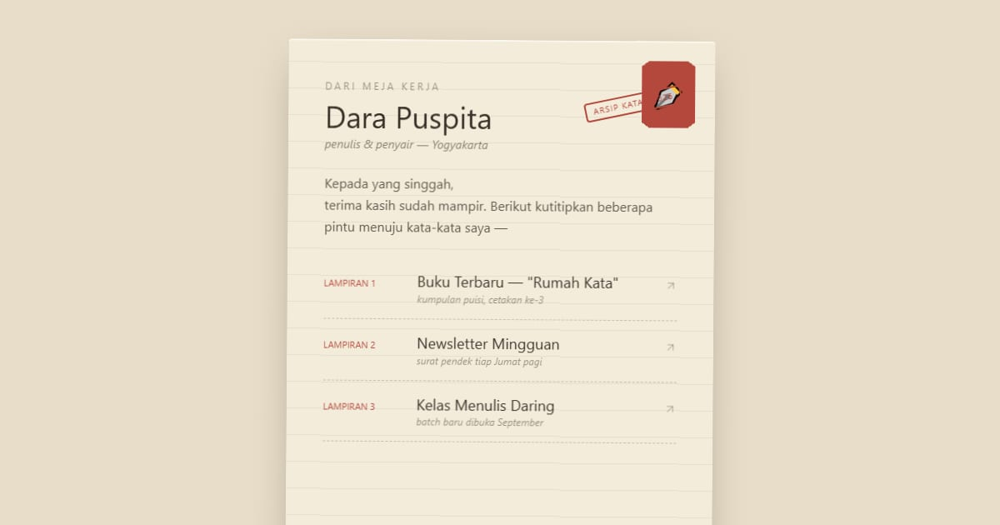

# Arsip Kata — Surat dari Dara

Link in bio penulis & penyair Dara: buku, newsletter, dan kelas menulis — tersimpan rapi dalam satu arsip.

**Demo live:** https://linkinbio-arsip.vercel.app



> Template link-in-bio dengan persona fiktif.

## Konsep

Persona Dara Puspita, penulis. Surat antik: kertas bergaris, perangko, animasi cap, dan tautan yang disusun sebagai "Lampiran 1–5".

## Halaman

`/`

## Teknologi

- Next.js 15.5 (App Router) dan React 19
- Tailwind CSS v4
- JavaScript
- Lucide (ikon)
- Font: Special Elite, Lora (next/font)
- SEO: metadata per halaman, Open Graph, JSON-LD, sitemap.xml, dan robots.txt

## Menjalankan secara lokal

```bash
npm install
npm run dev
```

Buka http://localhost:3000. Untuk build produksi: `npm run build` lalu `npm start`.

---

Bagian dari koleksi 12 template link-in-bio di [PortalBio](https://portal-bio-neon.vercel.app). Dibuat oleh [PintuWeb](https://pintuweb.com), jasa pembuatan website.
